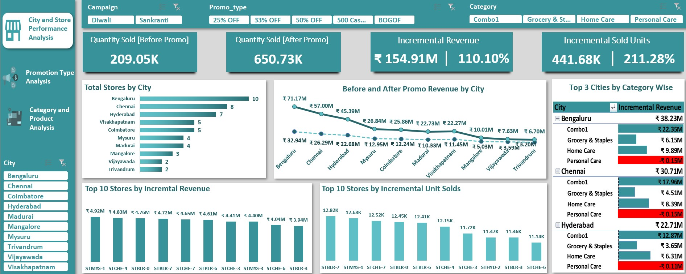
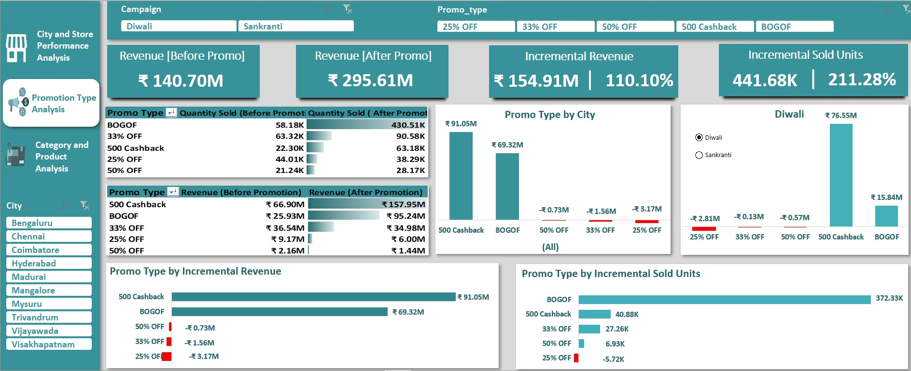
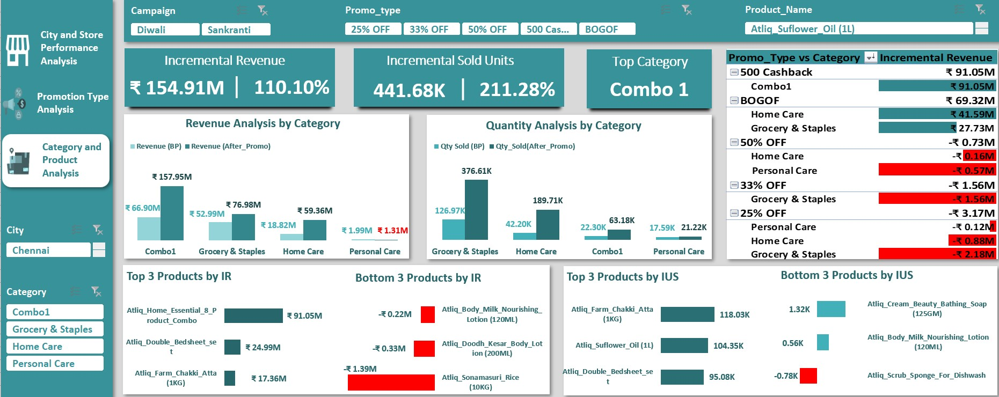
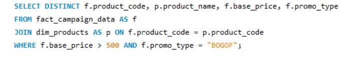
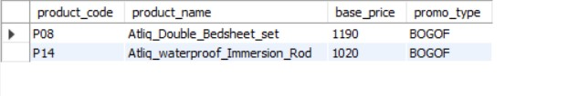
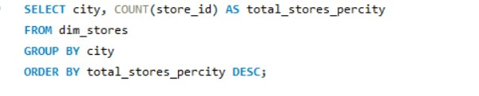
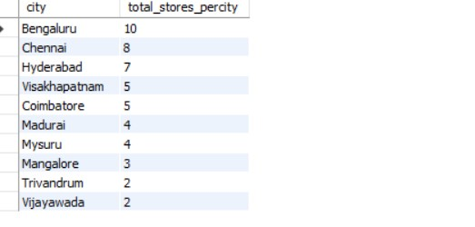
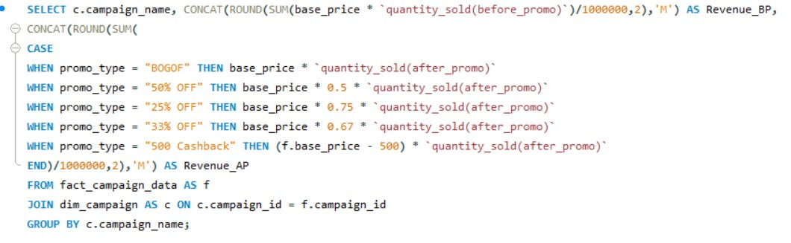
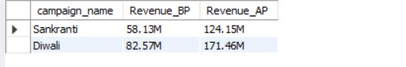

# Promotional_Performance_Analysis

## Problem Statement
**AtliQ Mart** is a retail giant with over 50 supermarkets in the southern region of India. All their 50 stores ran a massive promotion during the **Diwali 2023 and Sankranti 2024** (festive time in India) on their AtliQ branded products. Now the sales director wants to understand which promotions did well and which did not so that they can make informed decisions for their next promotional period. 

## Task
Analyse data, answer ad-hoc-requests using SQL and provide tangible insights to Sales Director.
### Desirable Insights from this analysis
* Which are the top and botttom cities and stores in terms of Increment Revenue (IR) and Increment Sold Units (ISU) generated from the promotions.
* How does the performance of stores vary by city.
* Which promotion type delivered the best or worst results?
* Which Product Categories saw the most significant lift in sales from the promotion.
* Are there specific products that responds exceptionally well or poorly to promotions ?

## Skills Used
 **SQL(MySQL)** to analyse data and ad-hoc-analysis
 
**Excel (Advanced Excel)** Utilized Advanced Excel for efficient data cleaning, manipulation, analysis, and visualization.

## Process
* Imported data into MySQL Workbench and addressed all ad hoc requests by writing optimized SQL queries.
* Exported the cleaned and structured data from MySQL to Microsoft Excel for further analysis.
* Performed data cleaning and manipulation in Excel using Power Query, VLOOKUPs, and other advanced Excel functions.
* Created data visualizations in Excel to highlight key insights and trends.

## City and Store Aanalysis  

## Promotion Type Analysis   

## Product and Category Analysis 

## Ad-hoc-Requests
###  List of products with a base price > 500 and that are featured in BOGOF promo type     

### Generate a report that provides an overview of the no of stores in each city.      

### Generate a report that displays each campaign along with total revenue generated before and after promotion      

### Produce a report that calculates ISU% for each category during Diwali campaign. Aditionally provide rankings for the category based on ISU% 

### Create a report featuring Top 5 Products ranked by IR% across each campaign. The report will provide essential information including product name, category, IR%

### Top 10 store in terms of IR generated from the promotion 

### Top 2 Promotion type taht resulted in highest IR
